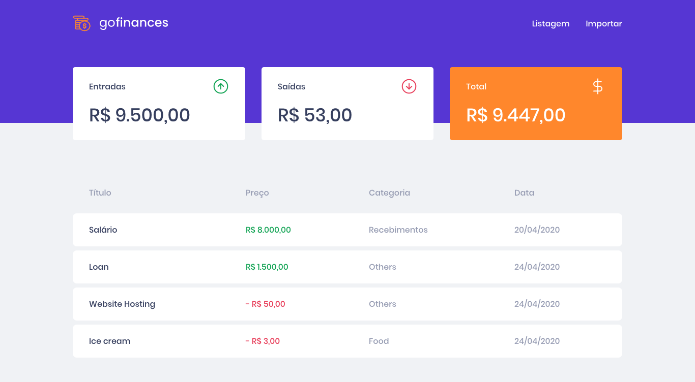
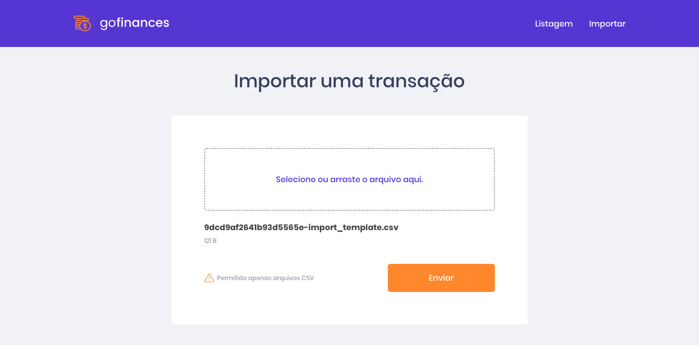

<h1 align="center">
    
</h1>

<h3 align="center">
  GoFinances Web - Desafio sobre React JS usando Typescript e realizando upload de arquivos aplicado no Bootcamp GoStack.
</h3>

<p align="center">
  <a href="#rocket-sobre-a-aplicação">Sobre a Aplicação</a>&nbsp;&nbsp;&nbsp;|&nbsp;&nbsp;&nbsp;
  <a href="#instalação">Instalação</a>&nbsp;&nbsp;&nbsp;|&nbsp;&nbsp;&nbsp;
  <a href="#executando-a-aplicação">Executando a Aplicação</a>&nbsp;&nbsp;&nbsp;|&nbsp;&nbsp;&nbsp;
  <a href="#executando-os-testes-da-aplicação">Executando os Testes da Aplicação</a>&nbsp;&nbsp;&nbsp;|&nbsp;&nbsp;&nbsp;
  <a href="#telas-da-aplicação">Telas da Aplicação</a>&nbsp;&nbsp;&nbsp;|&nbsp;&nbsp;&nbsp;
  <a href="#memo-licença">Licença</a>
</p>

## :rocket: Sobre a Aplicação

O GoFinances Web é uma aplicação criada com React JS para gestão de transações financeiras.

## Instalação

Instalação das dependências do projeto.

```sh
# Com NPM
npm install

# Com Yarn
yarn
```

## Executando a Aplicação

```sh
# Com NPM
npm run start

# Com Yarn
yarn start
```

## Telas da Aplicação

### Listagem de Transações



### Upload de Arquivo CSV com Transações



## :memo: Licença

Esse projeto está sob a licença MIT. Veja o arquivo [LICENSE](LICENSE.md) para mais detalhes.
